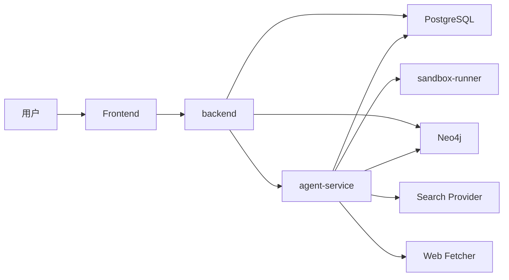

# SuperAgent Agent 平台 Codex 计划模式

这份文档用于把“完整 Agent 闭环”拆成多个可独立推进的 Codex Goal。目标不是一次性把全部能力塞给 Codex，而是把 Agent 平台拆成多个有清晰输入、输出、验证、退出标准和状态记录的小闭环阶段。

当前项目已经具备 `backend + frontend` 的 RAG MVP 基础，因此本计划书默认在现有系统上增量建设，不推倒原有对话、知识库、Trace 和多租户主链路。

## 计划模式定义

本文件按 “Codex 计划模式” 使用，含义固定如下：

1. 一次只推进一个阶段性 Goal，不把多个阶段混成一次实现。
2. 每个 Goal 都要求 Codex 直接落地代码、运行验证、回写结果，不接受只分析不实现。
3. 每个 Goal 都必须显式写清：
   - 输入依赖
   - 本次范围
   - 非目标
   - 必跑验证
   - 退出标准
   - 完成后如何更新本文档状态
4. 阶段状态只允许写：
   - `未开始`
   - `进行中`
   - `部分完成`
   - `已完成`
   - `阻塞`
5. 只有满足退出标准并完成必要验证，阶段状态才能从 `部分完成/进行中` 更新为 `已完成`。

## 当前阶段状态总览

以下状态用于描述当前仓库实现进度，不代表全部能力已经收口：

| 阶段 | 名称 | 当前状态 | 说明 |
| --- | --- | --- | --- |
| 1 | 基础契约、枚举升级与数据迁移 | 已完成 | `REACT_AGENT`、记忆策略枚举、Agent 相关迁移和基础配置已落地 |
| 2 | Agent Service 骨架与 SSE 桥接闭环 | 已完成 | `backend -> agent-service` 的最小 SSE 桥接和基础 run 闭环已打通 |
| 3 | 状态机执行器、步骤级 Checkpoint 与恢复 | 部分完成 | 有基础 checkpoint/resume，但恢复鲁棒性、故障回放和稳定步骤覆盖仍未收口 |
| 4 | 工具协议、插件注册中心与租户级启停 | 部分完成 | 已有最小工具抽象和 manifest 扫描骨架，但插件治理、审计和管理接口未完整 |
| 5 | 联网工具、HTTP 工具与受控 Python 执行 | 部分完成 | 已有 `knowledge.search`、基础 `web.search/web.fetch`、`http.request`、`python.sandbox` 雏形，但真实 provider、审计和风控未完成 |
| 6 | 摘要记忆与会话恢复策略 | 部分完成 | 记忆策略和摘要存储已接入，但摘要质量、压缩策略和长会话回归还未收口 |
| 7 | 三层执行体系与公开恢复接口 | 部分完成 | `resume` 用户接口已补，三层路由有基础实现，但规则和回归覆盖不完整 |
| 8 | 知识治理升级、版本化与切块策略 | 部分完成 | 上传、处理、重处理、版本回写和多种切块策略已接入主链路，知识库/文档页也已接入域与 profile 选择和版本可见性，但治理控制台和更细的运营能力仍未收口 |
| 9 | Neo4j 图谱与 `graph.query` 工具 | 部分完成 | Neo4j 持久化、图谱同步回写、`graph.query`、文档详情图谱查看/重建和治理页图谱文档入口已落地，但图路径查询能力和更深入的治理能力仍未收口 |
| 10 | Trace 扩展、管理控制台与前端 Agent 时间线 | 已完成 | Trace 双视角、Agent/Tools 设置、Tools/Plugins 控制台、治理页和 Agent 时间线均已接通，且前端仍只展示解释性摘要 |
| 11 | 评测框架、回放集与上线门禁 | 未开始 | 还缺 `agent-eval`、恢复成功率校验、工具轨迹断言和 CI 门禁 |

## 当前建议推进点

如果继续按计划模式推进，建议优先顺序固定为：

1. 优先继续收口阶段 9，把图路径查询、图谱治理深度和 Neo4j 验证补齐。
2. 再推进阶段 11，建立 `agent-eval`、回放集和 CI 门禁。
3. 阶段 8 的治理页已形成可运营入口，但更细粒度的运营能力仍可继续增强。

当前已知阻塞记录：

- 阶段 11 仍缺统一 `agent-eval` 套件和 CI 门禁，因此完整上线闭环还未完成。

## 使用原则

1. 每次只开一个阶段性 Goal，避免同时混入多个里程碑。
2. 每个 Goal 必须要求 Codex 完成实现、验证和结果记录，而不是只停留在分析。
3. 每个 Goal 都要先检查输入依赖，再开始写代码。
4. 每个 Goal 结束后先核对退出标准，再进入下一阶段。
5. 经典 RAG 主链路必须持续可用，Agent 失败不能拖垮现有知识问答。
6. 不保存、不展示模型原始 chain-of-thought，只保存解释性摘要。

## 每阶段投喂模板

后续给 Codex 开新 Goal 时，建议直接复制下面模板，只替换方括号内容：

```text
目标阶段：[阶段编号 + 名称]

请先阅读：
- [最小必要文档 1]
- [最小必要文档 2]
- [必要时补 1-2 个实现文件]

本次只完成：
- [本次明确交付 1]
- [本次明确交付 2]
- [本次明确交付 3]

这次不要做：
- [非目标 1]
- [非目标 2]

必须验证：
- [命令 1]
- [命令 2]

完成后请明确回答：
1. 本阶段实际完成了哪些交付物？
2. 哪些退出标准已满足，哪些还没满足？
3. 有没有残余风险或已知缺口？
4. 你更新了 docs/07-agent-platform-plan.md 中对应阶段的状态没有？
5. 下一次最适合从哪个具体文件或模块继续？
```

## 文档回写规则

每完成一个阶段或一次阶段内子闭环，都要同步更新本文档：

1. 在“当前阶段状态总览”里修改状态。
2. 在对应阶段标题下补一行 `当前状态：...`。
3. 如果只是完成阶段内一部分，就写 `当前状态：部分完成`，并补一行“剩余项”。
4. 如果有真实阻塞，就写 `当前状态：阻塞`，并写清具体阻塞点、影响范围和恢复条件。

## 全局约束

- 公共 API 仍由现有 `backend` 对外暴露。
- 前端不直接访问 `agent-service`。
- `agent-service` 与 `backend` 可以共享主数据库，但用独立表隔离 Agent 状态。
- 运行时继续以 Java 21 为主，`sandbox-runner` 固定使用 Python 3.11。
- 高风险工具默认关闭，必须按租户、环境、角色显式启用。
- `REACT_AGENT` 不替代 `RAG_QA`，而是把 RAG 作为 `knowledge.search` 工具纳入 Agent。
- 图谱能力使用 `Neo4j`，但图谱失败不能阻塞文档问答主链路。

## 推荐给 Codex 的固定说明

每个 Goal 开始时，可以附带这段固定说明：

```text
你正在实现 SuperAgent Agent 平台的一个阶段目标。请先阅读我指定的文档和现有代码，再直接落地实现。除非遇到真实阻塞，否则不要停留在分析。完成后必须运行必要验证，并明确说明哪些已完成、哪些未完成、有哪些风险，以及下一阶段依赖什么。
```

## 目标架构

最终目标架构固定为四层：

- `backend`
  - 负责认证、租户、会话、RAG、知识库、管理员接口、前端直连 API、SSE 对外桥接。
- `agent-service`
  - 负责 ReAct 编排、工具注册与执行、Checkpoint、摘要记忆、恢复执行、插件装配、MCP 兼容层。
- `sandbox-runner`
  - 负责受控 Python 代码执行，默认无外网、限时、限内存、限文件系统。
- `Neo4j`
  - 负责文档结构图谱和实体关系图谱，同时供后台治理和 Agent 图谱工具使用。



## 总体能力范围

本计划覆盖以下此前“部分有”或“没有”的能力补齐：

- 智能对话系统
  - SSE 流式输出、会话记录、停止生成、推荐追问、恢复执行
- RAG 文档问答
  - 上传文档、解析、切块、向量化、索引、基于证据回答
- 混合检索
  - 向量检索 + 关键词检索 + RRF 融合 + 可插拔 Rerank
- Agent 执行器
  - ReAct、联网搜索、工具调用、多步推理、Checkpoint 持久化
- 三层执行体系
  - `CLARIFICATION`、`RAG_QA`、`REACT_AGENT`
- 文档治理后台
  - 知识域、文档版本、切块策略、任务日志、结构图谱、图谱重建
- 会话记忆
  - `NONE`、`SLIDING_WINDOW`、`SUMMARY_WINDOW`、`SUMMARY_PLUS_WINDOW`
- 可观测性
  - 检索、执行阶段、模型调用、工具调用、恢复路径、图谱证据、Sandbox 轨迹

## 阶段 1：基础契约、枚举升级与数据迁移

当前状态：已完成

参考文档：

- [docs/01-technical-design.md](/Users/cheers/Desktop/workspace/SuperAgent/docs/01-technical-design.md)
- [docs/02-database-design.md](/Users/cheers/Desktop/workspace/SuperAgent/docs/02-database-design.md)
- [docs/03-api-design.md](/Users/cheers/Desktop/workspace/SuperAgent/docs/03-api-design.md)
- [docs/04-development-tasks.md](/Users/cheers/Desktop/workspace/SuperAgent/docs/04-development-tasks.md)
- [docs/06-local-development.md](/Users/cheers/Desktop/workspace/SuperAgent/docs/06-local-development.md)

Goal 描述：

```text
把 SuperAgent 的 Agent 二期能力先落到契约层。请升级执行模式、记忆策略、配置项和数据库迁移，补齐 Agent/Tool/Plugin/Checkpoint/Knowledge Domain/Chunking Profile/Document Version 的基础数据结构，并保持现有 RAG 主链路不受影响。
```

必须完成：

- `ExecutionMode` 正式使用 `REACT_AGENT`
- `MemoryStrategy` 增加 `SUMMARY_WINDOW`、`SUMMARY_PLUS_WINDOW`
- 数据库新增 Agent、Plugin、Tool、Checkpoint、Knowledge Domain、Chunking Profile、Document Version 相关表
- 配置项补齐 `AGENT_SERVICE_BASE_URL`、`SANDBOX_RUNNER_BASE_URL`、`NEO4J_*`、`SEARCH_PROVIDER` 等
- 本地开发文档补充 Agent Service、Sandbox Runner、Neo4j 依赖说明

验证建议：

- `cd /Users/cheers/Desktop/workspace/SuperAgent/backend && ./mvnw test`
- 空数据库执行迁移验证
- 配置加载冒烟测试

退出标准：

- 主库可正常迁移
- 现有 RAG 路径不因新枚举或新表受损
- Agent 平台后续阶段所需核心表和配置已具备

下一阶段依赖：

- 阶段 2

## 阶段 2：Agent Service 骨架与 SSE 桥接闭环

当前状态：已完成

参考文档：

- [docs/01-technical-design.md](/Users/cheers/Desktop/workspace/SuperAgent/docs/01-technical-design.md)
- [docs/03-api-design.md](/Users/cheers/Desktop/workspace/SuperAgent/docs/03-api-design.md)
- [docs/06-local-development.md](/Users/cheers/Desktop/workspace/SuperAgent/docs/06-local-development.md)
- [docs/07-agent-platform-plan.md](/Users/cheers/Desktop/workspace/SuperAgent/docs/07-agent-platform-plan.md)

Goal 描述：

```text
新增独立的 agent-service，并让 backend 对 REACT_AGENT 路径进行内部转发和 SSE 桥接。请打通 run 创建、事件流、取消、失败、恢复和消息最终持久化，形成最小 Agent 执行闭环，但先只接最小工具集。
```

必须完成：

- 新建 `agent-service/` 服务骨架
- 提供内部接口：
  - `POST /internal/agent-runs`
  - `GET /internal/agent-runs/{runId}/stream`
  - `POST /internal/agent-runs/{runId}/resume`
  - `POST /internal/agent-runs/{runId}/cancel`
- `backend` 能将 `REACT_AGENT` 请求转发到 `agent-service`
- `backend` 能把内部事件桥接为前端 SSE
- SSE 至少支持：
  - `agent_step`
  - `tool_start`
  - `tool_result`
  - `checkpoint`
  - `resume`
  - `done`
  - `error`
- 最小 Agent 闭环先支持：
  - `knowledge.search`
  - `web.search`
  - `web.fetch`

验证建议：

- `cd /Users/cheers/Desktop/workspace/SuperAgent/backend && ./mvnw test -DskipITs`
- `cd /Users/cheers/Desktop/workspace/SuperAgent/agent-service && mvn test`
- 一次端到端流式调用冒烟验证

退出标准：

- 用户经 `backend` 访问统一对话接口时，可收到 Agent 事件流
- Agent run 可以取消、失败、恢复
- 现有 `RAG_QA` SSE 能力不回归

下一阶段依赖：

- 阶段 3

## 阶段 3：状态机执行器、步骤级 Checkpoint 与恢复

当前状态：部分完成

剩余项：

- 强制中断后的稳定恢复测试仍需补齐
- 服务重启后步骤级幂等恢复仍需增强
- checkpoint 覆盖率和恢复成功率尚未纳入门禁

参考文档：

- [docs/01-technical-design.md](/Users/cheers/Desktop/workspace/SuperAgent/docs/01-technical-design.md)
- [docs/02-database-design.md](/Users/cheers/Desktop/workspace/SuperAgent/docs/02-database-design.md)
- [docs/07-agent-platform-plan.md](/Users/cheers/Desktop/workspace/SuperAgent/docs/07-agent-platform-plan.md)

Goal 描述：

```text
把最小 Agent 执行骨架升级为状态机式执行器。请用 PLAN、SELECT_TOOL、EXECUTE_TOOL、OBSERVE、DECIDE_NEXT、COMPLETE/FAILED/CANCELLED 这些固定状态驱动执行，并在每个稳定步骤落盘 checkpoint，实现服务重启或异常后的步骤级恢复。
```

必须完成：

- `agent-service` 采用状态机而不是单个大循环
- 每个稳定步骤写入 `agent_run_step` 与 `agent_checkpoint`
- Checkpoint 至少覆盖：
  - 模型决策后
  - 工具调用开始时
  - 工具调用结束时
  - observation 摘要生成后
- 支持从最近 `stable checkpoint` 恢复
- 达到最大步数或最大工具调用次数时强制结束
- 工具失败进入结构化错误分支，而不是直接崩溃

验证建议：

- 构造强制中断后恢复测试
- `agent-service` 单元测试覆盖状态推进与恢复逻辑
- `backend` 侧补一条 resume 集成验证

退出标准：

- 服务重启后可恢复未完成 run
- 已完成稳定步骤不会被重复执行
- 运行上限保护生效

下一阶段依赖：

- 阶段 4

## 阶段 4：工具协议、插件注册中心与租户级启停

当前状态：部分完成

剩余项：

- 插件治理接口和后台页面未完整
- 租户级密钥、参数模板和高风险工具审计未收口
- 工具超时、重试、熔断和限流策略仍需完善

参考文档：

- [docs/01-technical-design.md](/Users/cheers/Desktop/workspace/SuperAgent/docs/01-technical-design.md)
- [docs/03-api-design.md](/Users/cheers/Desktop/workspace/SuperAgent/docs/03-api-design.md)
- [docs/07-agent-platform-plan.md](/Users/cheers/Desktop/workspace/SuperAgent/docs/07-agent-platform-plan.md)

Goal 描述：

```text
建立可治理的工具系统。请实现 ToolSpec、ToolInvocation、ToolResult 三个核心抽象，接入 plugins/<plugin-key>/manifest.json 扫描、数据库注册、租户级启停、参数模板和密钥引用，并让 Agent 执行时只暴露当前租户可用的工具。
```

必须完成：

- 实现 `ToolSpec / ToolInvocation / ToolResult`
- 支持启动时扫描 `plugins/<plugin-key>/manifest.json`
- 数据库记录：
  - 插件安装状态
  - 插件版本
  - 租户启用关系
  - 密钥引用
  - 参数模板
- 运行时按租户过滤可见工具
- 提供管理接口：
  - `GET /api/v1/admin/plugins`
  - `PATCH /api/v1/admin/plugins/{pluginId}`
  - `GET /api/v1/admin/tool-calls`
- 后台可查看最近工具调用和错误

验证建议：

- manifest 扫描测试
- tenant binding 权限测试
- 插件启停后工具可见性测试

退出标准：

- 未授权租户看不到高风险工具
- Agent 实际执行时只可调用租户已启用工具
- 插件元数据与数据库状态一致

可并行：

- 阶段 5 可在接口稳定后并行推进

## 阶段 5：联网工具、HTTP 工具与受控 Python 执行

当前状态：部分完成

剩余项：

- `web.search` 还未接成真实生产级 provider 闭环
- `web.fetch` 的页面抽取、摘录和引用链路仍需增强
- `http.request` 的治理、审计和写方法授权未完成
- `python.sandbox` 的后台治理和角色控制未完整打通

参考文档：

- [docs/01-technical-design.md](/Users/cheers/Desktop/workspace/SuperAgent/docs/01-technical-design.md)
- [docs/06-local-development.md](/Users/cheers/Desktop/workspace/SuperAgent/docs/06-local-development.md)
- [docs/07-agent-platform-plan.md](/Users/cheers/Desktop/workspace/SuperAgent/docs/07-agent-platform-plan.md)

Goal 描述：

```text
补齐 Agent 一期工具集。请实现 web.search、web.fetch、http.request 和 python.sandbox，并落实搜索适配器、抓取摘录、allowlist、默认 GET 限制、风险开关、工具超时、重试、审计和 Sandbox 调用链路。
```

必须完成：

- `web.search`
  - 默认使用 `Tavily` 适配器
- `web.fetch`
  - 输出标题、URL、发布时间、正文摘要、抓取时间
- `http.request`
  - 默认仅 `GET`
  - 默认只允许 allowlist 域名
- `sandbox-runner/`
  - 提供内部执行接口
  - 默认无外网
  - 限 CPU、内存、时长、输出大小、写目录
- `agent-service` 接入 `python.sandbox`
- 高风险工具必须受角色、租户、环境三级开关控制

验证建议：

- `agent-service <-> sandbox-runner` 集成测试
- HTTP allowlist 拒绝测试
- 搜索和抓取结构化结果测试
- 工具超时与重试测试

退出标准：

- Agent 可稳定调用联网和受控代码执行工具
- 风险工具在未授权租户中不可见且不可调用
- 工具错误有结构化记录和可追踪审计

下一阶段依赖：

- 阶段 6

## 阶段 6：摘要记忆与会话恢复策略

当前状态：部分完成

剩余项：

- 摘要压缩质量仍是规则型，尚未形成稳定评估闭环
- 长会话回归、摘要刷新频率和默认策略还需验证

参考文档：

- [docs/01-technical-design.md](/Users/cheers/Desktop/workspace/SuperAgent/docs/01-technical-design.md)
- [docs/02-database-design.md](/Users/cheers/Desktop/workspace/SuperAgent/docs/02-database-design.md)
- [docs/07-agent-platform-plan.md](/Users/cheers/Desktop/workspace/SuperAgent/docs/07-agent-platform-plan.md)

Goal 描述：

```text
把会话记忆从窗口模式扩展为可生产使用的多策略体系。请实现 NONE、SLIDING_WINDOW、SUMMARY_WINDOW、SUMMARY_PLUS_WINDOW 四种策略，升级 conversation_memory_summary 为真实摘要存储，并让 Agent 默认走摘要加窗口模式。
```

必须完成：

- 记忆策略枚举和运行时选择逻辑完整接入
- `conversation_memory_summary` 成为真实可读写摘要存储
- 每 N 轮对话自动压缩摘要
- `RAG_QA` 保持窗口优先
- `REACT_AGENT` 默认走 `SUMMARY_PLUS_WINDOW`
- 不做无限长原文拼接

验证建议：

- 摘要生成与读取单元测试
- 不同执行模式上下文组装测试
- 长会话回归测试

退出标准：

- 长会话上下文长度可控
- Agent 能利用摘要记忆而不是只依赖最近窗口
- 现有问答质量无明显回退

下一阶段依赖：

- 阶段 7

## 阶段 7：三层执行体系与公开恢复接口

当前状态：部分完成

剩余项：

- `CLARIFICATION / RAG_QA / REACT_AGENT` 路由规则仍需补更严格测试
- 开放式任务、多步任务和歧义追问场景的回归集未完成

参考文档：

- [docs/03-api-design.md](/Users/cheers/Desktop/workspace/SuperAgent/docs/03-api-design.md)
- [docs/07-agent-platform-plan.md](/Users/cheers/Desktop/workspace/SuperAgent/docs/07-agent-platform-plan.md)

Goal 描述：

```text
把对话执行模式正式升级为三层执行体系。请明确 CLARIFICATION、RAG_QA、REACT_AGENT 的路由规则，补齐公开 resume 接口，并确保用户仍通过同一聊天入口访问不同执行器。
```

必须完成：

- 执行模式固定为：
  - `CLARIFICATION`
  - `RAG_QA`
  - `REACT_AGENT`
- 路由规则固定：
  - 歧义问题走 `CLARIFICATION`
  - 明确知识问答走 `RAG_QA`
  - 实时、多步、跨系统任务走 `REACT_AGENT`
- 新增用户接口：
  - `POST /api/v1/conversations/{sessionId}/resume`
- 会话与 Agent run 建立可恢复关联
- 同一对话入口继续兼容原有 SSE 协议

验证建议：

- 路由分类测试
- resume 用户链路测试
- 歧义追问和开放式 Agent 场景回归

退出标准：

- 用户无需切换入口即可访问三种执行模式
- Resume 能从最近未完成 run 恢复
- 模式选择结果与预期一致

下一阶段依赖：

- 阶段 8

## 阶段 8：知识治理升级、版本化与切块策略

当前状态：部分完成

剩余项：

- 管理台层面的知识域、版本、切块策略页面还未补齐
- 知识域和切块 profile 的更细粒度运营策略仍未实现
- 版本治理尚未覆盖更多后台筛选、失败回放和操作审计
- 目前前端只补了知识库上传和文档详情可见性，未形成独立治理工作台

参考文档：

- [docs/02-database-design.md](/Users/cheers/Desktop/workspace/SuperAgent/docs/02-database-design.md)
- [docs/03-api-design.md](/Users/cheers/Desktop/workspace/SuperAgent/docs/03-api-design.md)
- [docs/05-frontend-ux-spec.md](/Users/cheers/Desktop/workspace/SuperAgent/docs/05-frontend-ux-spec.md)
- [docs/07-agent-platform-plan.md](/Users/cheers/Desktop/workspace/SuperAgent/docs/07-agent-platform-plan.md)

Goal 描述：

```text
把文档后台从上传和任务日志升级为治理控制台。请实现 knowledge_domain、knowledge_document_version、chunking_profile 的真实能力，支持文档版本、切块 profile 绑定、重处理替换索引和治理接口，并保持现有文档问答链路兼容。
```

必须完成：

- `knowledge_domain` 管理能力
- `knowledge_document_version` 版本化能力
- `chunking_profile` 配置能力
- 一期切块策略支持：
  - `recursive`
  - `markdown_heading`
  - `slide_section`
- 提供接口：
  - `GET/POST/PATCH /api/v1/admin/knowledge-domains`
  - `GET/POST/PATCH /api/v1/admin/chunking-profiles`
  - `GET /api/v1/documents/{documentId}/versions`
- 文档重处理时按版本替换索引

验证建议：

- 文档重处理测试
- 版本替换测试
- 不同 chunking profile 的切块结果测试

退出标准：

- 后台可管理知识域、版本和切块策略
- 文档版本切换不会破坏现有检索主链路
- 知识库治理进入可运营状态

可并行：

- 阶段 9 可在数据结构稳定后并行推进

## 阶段 9：Neo4j 图谱与 graph.query 工具

当前状态：部分完成

剩余项：

- `Neo4j` 持久化与同步已接入，但图路径、多跳关系和更强的实体检索能力仍较弱
- `graph.query` 已接入 `agent-service`，但还缺更强的图路径/实体关系查询能力
- 图谱治理页已接入文档入口，但更完整的独立图谱治理后台仍未完成

参考文档：

- [docs/01-technical-design.md](/Users/cheers/Desktop/workspace/SuperAgent/docs/01-technical-design.md)
- [docs/05-frontend-ux-spec.md](/Users/cheers/Desktop/workspace/SuperAgent/docs/05-frontend-ux-spec.md)
- [docs/07-agent-platform-plan.md](/Users/cheers/Desktop/workspace/SuperAgent/docs/07-agent-platform-plan.md)

Goal 描述：

```text
实现文档结构图谱与实体关系图谱。请在文档处理流水线中抽取层级结构、章节关系、实体与关系并同步到 Neo4j，同时提供 graph.query 工具和文档图谱查看能力，但图谱失败不能阻塞文档 ready。
```

必须完成：

- Neo4j 节点：
  - `KnowledgeBase`
  - `Document`
  - `Section`
  - `Chunk`
  - `Entity`
- Neo4j 边：
  - `CONTAINS`
  - `NEXT`
  - `MENTIONS`
  - `RELATES_TO`
- 文档图谱同步状态回写 PostgreSQL
- 提供接口：
  - `GET /api/v1/documents/{documentId}/graph`
  - `POST /api/v1/documents/{documentId}/graph/rebuild`
- 提供 `graph.query` 工具
- 图谱失败仅标记 `graphSyncStatus`，不阻塞文档可用

验证建议：

- `agent-service <-> Neo4j` 集成测试
- 图谱重建测试
- 图谱故障降级测试

退出标准：

- 管理台可查看文档结构图和关系图
- Agent 能通过 `graph.query` 获取图谱证据
- 图谱不可用时现有 RAG 不受阻塞

下一阶段依赖：

- 阶段 10

## 阶段 10：Trace 扩展、管理控制台与前端 Agent 时间线

当前状态：已完成

本阶段已完成：

- Trace 详情页已支持 exchange trace 与 agent run 双视角
- 已补齐工具调用、Checkpoint、恢复链路 tab，并展示 `pluginVersion`、`searchEvidence`、`graphEvidence`、`sandboxExecution`
- 设置页已补齐 Agent 和 Tools 配置分区
- 管理台已新增 Tools / Plugins 控制台与治理页入口
- 对话页继续只展示 Agent 阶段、工具摘要和恢复提示，不展示原始思维链

参考文档：

- [docs/05-frontend-ux-spec.md](/Users/cheers/Desktop/workspace/SuperAgent/docs/05-frontend-ux-spec.md)
- [docs/07-agent-platform-plan.md](/Users/cheers/Desktop/workspace/SuperAgent/docs/07-agent-platform-plan.md)

Goal 描述：

```text
把 Agent 能力补齐到可运营、可排障的控制台层。请扩展 Trace 为 exchange trace 和 agent run trace 双视角，在前端对话页、Trace 页、设置页、插件页、Graph 页、Chunking Profile 页展示 Agent 时间线、工具调用、Checkpoint、恢复链路和治理配置，但不要展示原始思维链。
```

必须完成：

- Trace 明细新增：
  - `toolCalls`
  - `checkpoints`
  - `resumeEvents`
  - `pluginVersion`
  - `searchEvidence`
  - `graphEvidence`
  - `sandboxExecution`
- 前端对话页显示：
  - Agent 时间线
  - 工具调用卡片
  - Checkpoint 状态
  - 恢复提示
- Trace 页新增：
  - Agent 模式筛选
  - 工具调用 tab
  - Checkpoint tab
  - 恢复链路 tab
- 设置页新增：
  - Agent 配置分区
  - Tools 配置分区
- 管理台新增：
  - Tools 页面
  - Plugins 页面
  - Graph 页面
  - Chunking Profile 页面
- 文档详情页新增：
  - 版本列表
  - 结构图
  - 图谱同步状态

验证建议：

- `cd /Users/cheers/Desktop/workspace/SuperAgent/frontend && npm run build`
- 前端事件解析测试
- 手工验证 Agent 时间线和恢复展示

退出标准：

- 管理员能看到可用的 Agent 运行轨迹和工具调用链路
- 普通用户能在对话页理解 Agent 当前阶段和恢复状态
- 前端不暴露模型原始 chain-of-thought

下一阶段依赖：

- 阶段 11

## 阶段 11：评测框架、回放集与上线门禁

当前状态：未开始

参考文档：

- [docs/04-development-tasks.md](/Users/cheers/Desktop/workspace/SuperAgent/docs/04-development-tasks.md)
- [docs/07-agent-platform-plan.md](/Users/cheers/Desktop/workspace/SuperAgent/docs/07-agent-platform-plan.md)

Goal 描述：

```text
为 Agent 平台建立基础评测和上线门禁。请实现固定回放数据集、关键工具轨迹断言、RAG 与 Agent 双模式回归集和 CI 中的 agent-eval 套件，并把恢复成功率、工具轨迹完整率和高风险工具可见性纳入验收阈值。
```

必须完成：

- 固定回放数据集
- 关键工具轨迹断言
- RAG 与 Agent 双模式回归集
- CI 执行 `agent-eval`
- 验收阈值纳入门禁：
  - 关键 E2E 全通过
  - Agent 回放集通过率 `>= 85%`
  - 强制重启后 checkpoint 恢复成功率 `>= 95%`
  - 工具调用轨迹结构化字段完整率 `= 100%`
  - 高风险工具在未授权租户中不可见率 `= 100%`

验证建议：

- 本地执行评测脚本
- CI 冒烟验证
- 恶意或未授权场景回归验证

退出标准：

- Agent 平台具备基本上线门禁
- 回归测试可覆盖 RAG、Agent、恢复、权限和高风险工具
- 发布前可以用统一评测集判断是否回归

## 关键接口清单

公共对外接口：

- `/api/v1/conversations/{sessionId}/messages/stream`
- `POST /api/v1/conversations/{sessionId}/resume`
- `GET /api/v1/admin/agent-runs`
- `GET /api/v1/admin/agent-runs/{runId}`
- `GET /api/v1/admin/agent-runs/{runId}/checkpoints`
- `GET /api/v1/admin/tool-calls`
- `GET /api/v1/admin/plugins`
- `PATCH /api/v1/admin/plugins/{pluginId}`
- `GET/PATCH /api/v1/admin/settings/agent`
- `GET/PATCH /api/v1/admin/settings/tools`
- `GET/POST/PATCH /api/v1/admin/knowledge-domains`
- `GET/POST/PATCH /api/v1/admin/chunking-profiles`
- `GET /api/v1/documents/{documentId}/versions`
- `GET /api/v1/documents/{documentId}/graph`
- `POST /api/v1/documents/{documentId}/graph/rebuild`

内部接口：

- `POST /internal/agent-runs`
- `GET /internal/agent-runs/{runId}/stream`
- `POST /internal/agent-runs/{runId}/resume`
- `POST /internal/agent-runs/{runId}/cancel`
- `/internal/sandbox/execute`

## 关键运行时配置

- `AGENT_SERVICE_BASE_URL`
- `SANDBOX_RUNNER_BASE_URL`
- `NEO4J_URI`
- `NEO4J_USERNAME`
- `NEO4J_PASSWORD`
- `SEARCH_PROVIDER`
- `AGENT_ENABLED_DEFAULT`
- `AGENT_MAX_MODEL_STEPS`
- `AGENT_MAX_TOOL_CALLS`
- `AGENT_CHECKPOINT_ENABLED`
- `CODE_EXECUTION_ENABLED`

## 推荐推进顺序

推荐按以下顺序投喂 Codex，而不是跨阶段混做：

1. 阶段 1：先把枚举、迁移、配置和契约补齐。
2. 阶段 2：打通最小 Agent Service 与 SSE 桥接闭环。
3. 阶段 3：补状态机、Checkpoint 和恢复。
4. 阶段 4-5：补可治理工具系统与受控执行。
5. 阶段 6-7：补记忆体系与三层执行路由。
6. 阶段 8-9：补知识治理和图谱。
7. 阶段 10-11：最后收口控制台、Trace 和评测门禁。

如果按当前仓库状态继续推进，建议改成下面这个更具体的执行序列：

1. 修复当前 `backend` 回归测试阻塞。
2. 收口阶段 8，让治理元数据真正进入处理流水线。
3. 开始阶段 9，实现图谱同步和 `graph.query`。
4. 收口阶段 10，补管理控制台和 Trace 双视角。
5. 最后完成阶段 11，把评测、恢复成功率和权限门禁纳入 CI。

## 计划状态说明

本文档是 Codex 计划模式下的实施方案，不代表所有阶段都已完成；除非某阶段明确写成 `已完成`，否则一律视为仍需继续开发。

如果需要把这份文档用于继续推进开发，建议每完成一个阶段就在文档顶部或对应章节补一行状态，例如：

- `状态：未开始`
- `状态：进行中`
- `状态：已完成`
- `状态：阻塞，原因是 ...`
