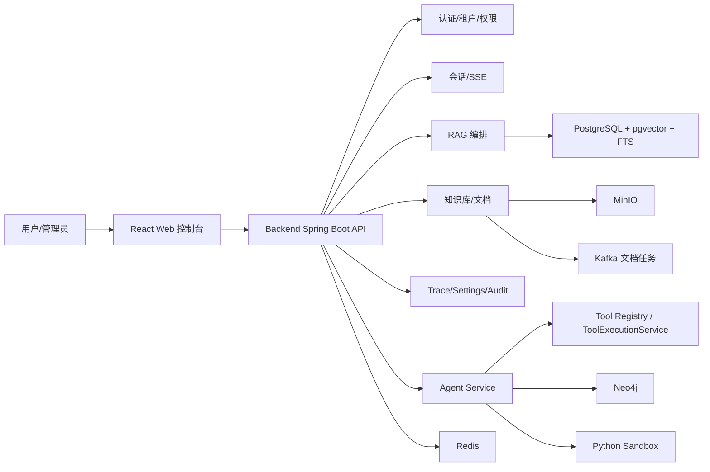

# SuperAgent 技术设计

本文描述当前架构和主要边界。详细接口以 Controller/OpenAPI 为准，数据库以 Flyway migration 为准。

## 总体架构

SuperAgent 当前采用：

- Backend 模块化单体：业务 API、认证、会话、RAG、知识库、Trace、设置、评测、审计。
- 独立 Agent Service：Agent Run 生命周期、工具注册、工具执行、Checkpoint、恢复、取消。
- React Web 控制台：对话工作台和管理控制台。
- Sandbox Runner：隔离执行 Python 工具。

## 技术栈

- Backend / Agent Service：Java 21、Spring Boot 3.5.16、Spring AI 1.1.8。
- 数据：PostgreSQL、Flyway、pgvector、pg_trgm、Redis、MinIO、Kafka、Neo4j。
- Frontend：React 19、Vite 8、React Router 7、Zustand、TanStack Query/Table、assistant-ui。
- 测试：JUnit、Vitest、Playwright。

## Backend 边界

Backend 负责产品主链路：

- Auth / Tenant / Member。
- Conversation、SSE、Memory、Execution planning。
- RAG：query understanding、rewrite、decomposition、retrieval、RRF、rerank、evidence budget、citation。
- Knowledge / Document：upload、parse、chunk、embedding、index、task、version、graph。
- Runtime settings、Trace、Audit、Feedback、Evaluation。
- 通过 `AGENT_SERVICE_BASE_URL` 调用独立 Agent Service。

模型和 embedding 调用已通过 Spring AI：

- Chat：`ChatModel`
- Embedding：`EmbeddingModel`
- Query Understanding：`BeanOutputConverter` structured output

Rerank 仍使用自研 OpenAI-compatible 客户端。

## Agent Service 边界

Agent Service 负责产品级 Agent runtime：

- Run 创建、恢复、取消。
- SSE event 协议。
- Run / Step / Tool Call / Checkpoint 持久化。
- 运行策略：最大模型步数、最大工具调用次数、checkpoint 开关。
- 工具注册、工具权限、risk/allowlist/secret binding。
- 插件 manifest 加载。
- 工具执行与审计。

Spring AI 在 Agent Service 中负责：

- `ChatModel` 模型调用。
- `ToolCallback` tool-calling 协议桥接。
- `BeanOutputConverter` Agent decision structured output。
- `ObservationRegistry` 模型调用观测接入。

Spring AI 不负责：

- checkpoint / resume / cancel / pause。
- SSE 协议和前端交互状态。
- 租户级 runtime settings 生效逻辑。
- 工具风险控制、allowlist、secret binding。
- run/step/tool_call 持久化和审计。

这个边界刻意保留：Spring AI 做模型协议层，产品运行时继续自研。

## RAG 编排

RAG 主链路：

1. 读取会话记忆和请求上下文。
2. Query Understanding 生成 rewritten question、sub questions、answer mode。
3. 向量检索和关键词检索。
4. RRF 融合。
5. 邻近 chunk 扩展。
6. 可选 rerank。
7. 证据裁剪和引用映射。
8. ChatModel 生成回答。
9. 持久化消息、引用、Trace 和运行指标。

关键约束：

- 无足够证据时走兜底回答。
- 引用编号必须映射到已选证据。
- 证据预算必须限制 prompt 大小。
- Rerank 失败不能阻断主流程。

## Frontend 边界

Frontend 是 React SPA：

- React Router 管理路由和权限守卫。
- Zustand 管理 auth、chat、settings 等客户端状态。
- TanStack Query 管理服务端数据缓存。
- assistant-ui 承载对话 Thread/Message/Composer 交互，但不替换后端 SSE 协议。
- SSE 事件包括 `start`、`trace_stage`、`delta`、`reference`、`recommendation`、`agent_step`、`tool_start`、`tool_result`、`checkpoint`、`resume`、`done`、`error`。

## 可观测性

- Trace 记录会话、RAG、模型调用、检索、Rerank、Agent Run、Tool Call、Checkpoint。
- Spring AI 模型调用接入 `ObservationRegistry`，可由 Micrometer/Actuator 承接。
- RAG runtime metrics 记录检索、rerank、引用覆盖和 fallback。

## 运行与部署

- 本地优先复用已有 PostgreSQL、Redis、MinIO、Kafka、Neo4j。
- Kafka 可关闭，本地用 inline document processing 验证文档链路。
- Agent Service 和 Sandbox Runner 可按需启动。
- 生产部署通过 GitHub Actions 打包 backend、agent-service、frontend、sandbox-runner、plugins，并交给服务器 systemd/Nginx。
